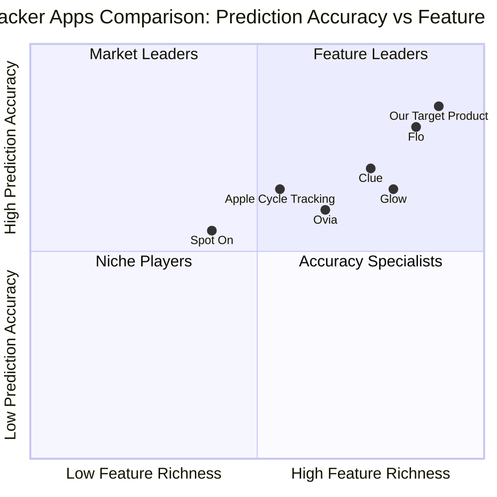

# Product Requirements Document (PRD)

## Period Tracker App Backend with ML Integration

*Document Version: 1.0*  
*Date: March 25, 2025*

---

## Table of Contents

1. [Project Overview](#1-project-overview)
2. [Product Goals](#2-product-goals)
3. [User Stories](#3-user-stories)
4. [Competitive Analysis](#4-competitive-analysis)
5. [Technical Specifications](#5-technical-specifications)
6. [Requirements Analysis](#6-requirements-analysis)
7. [Requirements Pool](#7-requirements-pool)
8. [User Interface Design Draft](#8-user-interface-design-draft)
9. [Open Questions](#9-open-questions)

---

## 1. Project Overview

### 1.1 Project Description

This project aims to develop a production-ready backend system with Machine Learning integration for a comprehensive period tracker application. The system will provide accurate period predictions, fertility tracking, and health insights through an ensemble of machine learning models. The backend architecture consists of a Laravel API for user management and a FastAPI component for the ML engine.

### 1.2 Project Scope

The period tracker app backend will include:

- Period tracking and prediction capabilities
- Fertility tracking and ovulation prediction
- Features for users trying to conceive (TTC)
- Comprehensive symptom and health tracking
- Lifestyle integration components
- Self-learning ML models that improve over time
- Admin dashboards for monitoring and model management
- Testing strategies for frontend integration

### 1.3 Target Users

- Women of reproductive age tracking their menstrual cycles
- Users planning pregnancy or trying to conceive
- Women monitoring reproductive health conditions
- Users looking to understand connections between lifestyle factors and cycle health
- Healthcare providers who may leverage user-shared data

### 1.4 Programming Languages

- Backend: PHP (Laravel Framework)
- ML Engine: Python (FastAPI Framework)
- Database: PostgreSQL
- Frontend Testing: JavaScript

---

## 2. Product Goals

1. **Build a highly accurate menstrual cycle prediction system** leveraging machine learning techniques to achieve prediction accuracy of 85-90% or higher.

2. **Create a scalable, maintainable architecture** that separates concerns between the main API (Laravel) and the ML engine (FastAPI) while ensuring seamless communication between components.

3. **Implement a continuous learning pipeline** that improves prediction models over time through collection and analysis of user feedback and cycle data.

---

## 3. User Stories

### 3.1 Period Tracking

As a user tracking my menstrual cycle, I want the app to accurately predict my next period date so that I can plan accordingly and be prepared.

### 3.2 Fertility Awareness

As a user practicing fertility awareness methods, I want precise ovulation predictions based on my historical cycle data and symptoms so that I can effectively plan or prevent pregnancy naturally.

### 3.3 Conception Planning

As a user trying to conceive, I want detailed insights about my fertile window with personalized recommendations so that I can maximize my chances of becoming pregnant.

### 3.4 Health Monitoring

As a user with menstrual health concerns, I want to track various symptoms and receive pattern insights so that I can discuss them effectively with my healthcare provider.

### 3.5 Data Management

As a privacy-conscious user, I want control over how my health data is used for model training so that I can participate while maintaining my personal comfort level with data sharing.

---

## 4. Competitive Analysis

### 4.1 Market Overview

The global period tracker apps market is valued between $1.4-3.5 billion in 2023-2024, with projections showing significant growth at a CAGR of 8.3-19.5% through 2030-2034. The market is driven by increasing awareness of menstrual health, rising digital literacy, and advancements in AI and machine learning technologies.

### 4.2 Competitor Analysis

| App | Strengths | Weaknesses |
|-----|-----------|------------|
| **Flo** | - AI-powered cycle predictions<br>- 70+ symptoms tracking<br>- Community features<br>- Strong privacy measures | - Premium features behind paywall<br>- Limited data export options<br>- Less transparent ML algorithms |
| **Clue** | - Science-based approach<br>- Gender-neutral design<br>- 20+ languages<br>- Research partnerships | - Less intuitive UI for beginners<br>- Limited TTC features<br>- Basic ML implementation |
| **Glow** | - Comprehensive fertility focus<br>- Partner app integration<br>- Detailed conception tools | - Privacy concerns<br>- Complex interface<br>- Requires premium for key features |
| **Ovia** | - Personalized insights<br>- Completely free<br>- Educational content | - Basic prediction algorithms<br>- Limited symptom correlations<br>- Less robust ML implementation |
| **Spot On** | - Strong privacy focus<br>- Simple interface<br>- Planned Parenthood backing | - Limited feature set<br>- Basic predictions<br>- No ML implementation |
| **Apple Cycle Tracking** | - Seamless iOS integration<br>- Privacy-centric<br>- Health app ecosystem | - Platform limited<br>- Basic predictions<br>- Limited customization |
| **Our Target Product** | - Advanced ML ensemble approach<br>- Self-learning capabilities<br>- Both period and fertility focus<br>- Comprehensive API | - New entrant to market<br>- Requires initial data collection phase |

### 4.3 Competitive Quadrant Chart



### 4.4 Competitive Edge

Our product will differentiate itself through:

1. **Superior ML Architecture**: Ensemble approach with multiple complementary models for higher accuracy
2. **Personalized Learning**: Individual user model fine-tuning alongside global model improvements
3. **Transparent Predictions**: Confidence scores and explanations for predictions
4. **Developer-Friendly API**: Well-documented endpoints for frontend integration and testing
5. **Self-Improving System**: Continuous learning pipeline that improves with user feedback

---

## 5. Technical Specifications

### 5.1 System Architecture

#### 5.1.1 Laravel Backend (API & Data Management)

- **Authentication & Authorization**:
  - JWT token-based authentication with refresh tokens
  - Role-based permissions system (users, admins, data scientists)
  - GDPR-compliant data handling with opt-in/opt-out controls

- **Database Architecture**:
  - PostgreSQL with optimized schema for time-series health data
  - Data partitioning strategy for scalable user growth
  - Encryption for sensitive health information

- **API Endpoints**:
  - User management (registration, profile, settings)
  - Cycle data logging (periods, symptoms, biometrics)
  - Prediction retrieval endpoints
  - Training data management
  - Admin and monitoring endpoints

#### 5.1.2 FastAPI ML Engine

- **Model Architecture**:
  - Ensemble approach combining:
    - ARIMA(1,0,0) time series model for cycle prediction
    - Random Forest Regressor for symptom-based cycle shifts
    - Gradient Boosting Regressor for fertility and ovulation tracking
  - User-specific model fine-tuning pipeline
  - Feature importance tracking for transparency

- **Training Pipeline**:
  - Initial training on anonymized dataset
  - Scheduled retraining based on new user data
  - Performance validation before deployment
  - Backup and rollback mechanisms

- **Model Serving**:
  - API endpoints for batch and real-time predictions
  - Versioned model endpoints for backward compatibility
  - Prediction confidence scores with every response

#### 5.1.3 Integration Layer

- **Communication Protocol**:
  - REST-based communication between Laravel and FastAPI
  - Asynchronous processing for non-critical tasks
  - Queueing system for model retraining tasks

- **Data Flow**:
  - Laravel collects and stores user data
  - FastAPI fetches training data from Laravel periodically
  - Predictions are requested from Laravel and served by FastAPI
  - Model updates are logged back to Laravel for admin dashboard

### 5.2 Machine Learning Implementation

#### 5.2.1 Data Collection & Preprocessing

- **Input Features**:
  - Historical cycle lengths and variations
  - Basal body temperature readings
  - Symptom data (categorized and weighted)
  - Lifestyle factors (sleep, exercise, stress)
  - Optional: data from connected devices

- **Data Preprocessing**:
  - Handling of missing data through imputation
  - Feature normalization and scaling
  - Outlier detection and handling
  - Feature engineering for derived metrics

#### 5.2.2 Model Components

- **ARIMA Time Series Model**:
  - Focus: Baseline cycle prediction
  - Features: Historical cycle lengths, seasonal patterns
  - Expected accuracy: ~87% for regular cycles

- **Random Forest Regressor**:
  - Focus: Symptom impact on cycle timing
  - Features: Symptoms, lifestyle factors, historical patterns
  - Expected accuracy: ~85% for symptom-cycle correlations

- **Gradient Boosting Regressor**:
  - Focus: Fertility window and ovulation timing
  - Features: Temperature, cervical fluid, ovulation tests, symptoms
  - Expected accuracy: ~82% for fertility predictions

- **Ensemble Integration**:
  - Weighted averaging of model predictions
  - Confidence score calculation based on model agreement
  - Expected combined accuracy: 85-90%

#### 5.2.3 Continuous Learning Strategy

- **Data Collection Pipeline**:
  - Store user cycle logs, symptoms, lifestyle data
  - Capture user feedback on prediction accuracy
  - Periodic extraction of anonymized training data

- **Retraining Schedule**:
  - Global model: Weekly retraining with all anonymized data
  - User-specific models: Monthly or after significant new data
  - Triggered retraining on accuracy drop below threshold

- **Model Validation**:
  - Validation against holdout historical data
  - A/B testing of model versions on subset of predictions
  - Deploy new model only if accuracy improves

### 5.3 Frontend Testing Strategy

- **API Testing Environment**:
  - Sandbox environment with mock data
  - Developer API keys for testing access
  - Rate limits adjusted for testing scenarios

- **Testing Tools Integration**:
  - Postman collection with test scenarios
  - Automated testing with Jest/Cypress
  - Network monitoring and debugging tools

- **Documentation**:
  - OpenAPI/Swagger documentation
  - Interactive API playground
  - Error code reference guide

---

## 6. Requirements Analysis

### 6.1 Core Functional Requirements

#### 6.1.1 Period Tracking & Prediction

- The system MUST allow users to log period start and end dates
- The system MUST store historical cycle data securely
- The system MUST generate predictions for upcoming periods
- The system MUST provide confidence scores with predictions
- The system SHOULD allow users to confirm or correct predictions
- The system SHOULD adapt to changing cycle patterns over time

#### 6.1.2 Fertility Tracking

- The system MUST predict fertility windows based on cycle data
- The system MUST incorporate basal body temperature for ovulation detection
- The system MUST allow tracking of fertility signals (cervical fluid, etc.)
- The system SHOULD provide ovulation day predictions with confidence scores
- The system SHOULD offer personalized insights based on tracked fertility data

#### 6.1.3 TTC Features

- The system MUST provide optimized predictions for conception
- The system MUST enable tracking of conception-related activities
- The system MUST offer statistics on conception probability
- The system SHOULD provide recommendations for improving conception chances
- The system SHOULD track pregnancy test results

#### 6.1.4 Symptom & Health Tracking

- The system MUST support tracking of at least 50 different symptoms
- The system MUST allow customizable symptom severity scales
- The system MUST identify correlations between symptoms and cycle phases
- The system SHOULD generate health insights based on symptom patterns
- The system SHOULD flag potentially concerning symptom patterns

#### 6.1.5 Lifestyle Integration

- The system MUST allow tracking of lifestyle factors (sleep, exercise, etc.)
- The system MUST analyze correlations between lifestyle and cycle health
- The system SHOULD provide actionable lifestyle recommendations
- The system MAY support integration with external fitness/health apps

### 6.2 Machine Learning Requirements

- The ML system MUST achieve prediction accuracy of at least 85%
- The ML system MUST improve accuracy over time with more data
- The ML system MUST handle both regular and irregular cycles
- The ML system MUST support user-specific model fine-tuning
- The ML system SHOULD explain feature importance for predictions
- The ML system SHOULD detect significant changes in user patterns

### 6.3 Backend & API Requirements

- The backend MUST implement secure authentication mechanisms
- The API MUST provide comprehensive CRUD operations for all data types
- The system MUST implement proper data encryption at rest and in transit
- The backend MUST handle high concurrent user loads efficiently
- All API endpoints MUST be thoroughly documented
- The system MUST implement proper error handling and logging

### 6.4 Admin & Monitoring Requirements

- The system MUST provide a dashboard for monitoring ML model performance
- The system MUST track accuracy metrics over time
- The system MUST support manual triggering of model retraining
- The system MUST log all model version deployments
- The system SHOULD detect data drift automatically
- The system SHOULD provide analytics on user cycle patterns

---

## 7. Requirements Pool

### 7.1 P0 (Must Have)

1. User authentication and account management system
2. Secure storage of menstrual cycle data
3. Basic period prediction using ensemble ML model
4. API endpoints for cycle data logging
5. API endpoints for retrieving predictions
6. ML model training pipeline
7. User feedback collection on prediction accuracy
8. Admin dashboard for basic monitoring
9. Security measures for sensitive health data
10. API documentation for frontend development

### 7.2 P1 (Should Have)

1. Fertility window predictions
2. Symptom tracking and correlation analysis
3. Personalized user model fine-tuning
4. Automatic model retraining pipeline
5. Confidence scores for all predictions
6. Performance monitoring and alerting
7. Lifestyle factor tracking and correlation
8. A/B testing framework for model improvements
9. Error tracking and reporting system
10. Testing environment for frontend developers
11. Historical data visualization endpoints
12. Export functionality for user data

### 7.3 P2 (Nice to Have)

1. Integration with wearable devices for additional data
2. Advanced TTC optimization algorithms
3. Explainable AI features for transparency
4. Multilingual support for international users
5. Machine learning-based symptom pattern detection
6. Anonymized population insights
7. Health condition risk assessment
8. Integration with external health platforms
9. Personalized health recommendations
10. Pregnancy mode with tailored predictions

---

## 8. User Interface Design Draft

*Note: This PRD focuses on backend and API components. The following represents the conceptual structure of admin interfaces and API interaction points.*

### 8.1 Admin Dashboard Layout

#### 8.1.1 Model Monitoring View

- Performance metrics section
  - Overall prediction accuracy
  - Accuracy by prediction type (period, ovulation, fertility)
  - Accuracy trends over time
- Model version history
  - Current active model versions
  - Performance comparison between versions
  - Rollback controls
- Training status section
  - Last training date
  - Training data volume
  - Training success/failure indicators

#### 8.1.2 User Data Analytics View

- User growth metrics
- Data quality metrics
- Aggregate cycle statistics (anonymized)
- Feature importance visualization
- Data drift detection alerts

### 8.2 API Structure Draft

#### 8.2.1 User Data Endpoints

```
/api/v1/users
  POST /register
  POST /login
  GET /profile
  PUT /profile
  PUT /settings

/api/v1/cycles
  GET /
  POST /
  PUT /{id}
  DELETE /{id}
  GET /statistics

/api/v1/symptoms
  GET /
  POST /
  GET /categories
  POST /{id}/log
  GET /{id}/correlations
```

#### 8.2.2 Prediction Endpoints

```
/api/v1/predictions
  GET /period
  GET /fertility
  GET /ovulation
  POST /feedback
  GET /confidence
  GET /explanation
```

#### 8.2.3 Admin Endpoints

```
/api/v1/admin
  GET /models
  GET /models/{id}/metrics
  POST /models/train
  PUT /models/{id}/activate
  GET /analytics
  GET /users/statistics
```

---

## 9. Open Questions

1. **Data Privacy Thresholds**: What is the minimum amount of anonymized data required before training the initial models?

2. **Accuracy Metrics**: Which metric should be prioritized for evaluating model performance - mean absolute error in days, precision of fertility window, or user satisfaction scores?

3. **Model Personalization**: To what extent should individual models diverge from the global model as they become personalized?

4. **User Feedback Integration**: How should we weight explicit user feedback compared to observed cycle data when evaluating model performance?

5. **Regulatory Considerations**: What additional security measures might be required if the app is classified as a medical device in certain regions?

6. **Edge Cases**: How should the system handle major disruptions to cycle patterns (e.g., pregnancy, menopause, hormonal treatments)?

7. **Integration Priorities**: Which third-party health systems should be prioritized for potential integration?

8. **Scaling Strategy**: What is the expected user growth rate, and how should the architecture adapt to increasing data volume?

---

## Appendix: Key Performance Indicators (KPIs)

1. **Prediction Accuracy**: 85-90% accuracy for period start date prediction
2. **User Retention Rate**: >70% active users after 3 months
3. **Cycle Prediction Error Margin**: <3 days average error
4. **User Satisfaction Score**: >4.5/5 for prediction features
5. **System Reliability**: 99.9% uptime for API services
6. **Model Improvement Rate**: 5% accuracy improvement every 6 months
7. **API Response Time**: <200ms average response time
8. **Data Processing Efficiency**: <10 minutes for complete model retraining
